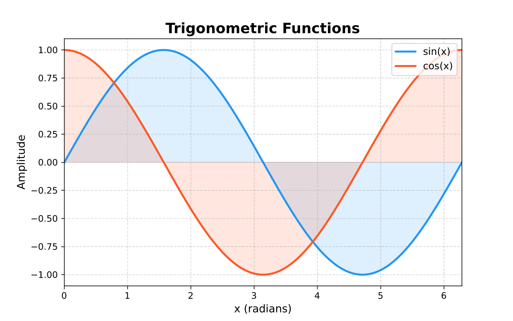
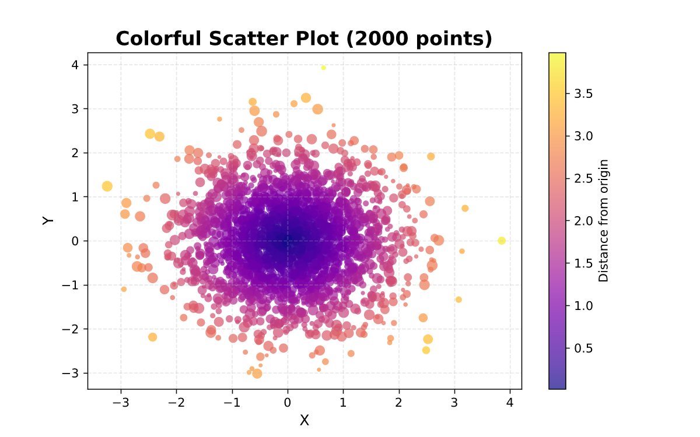
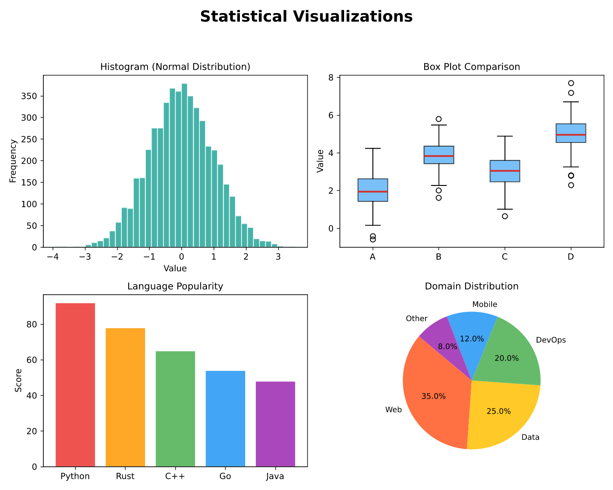
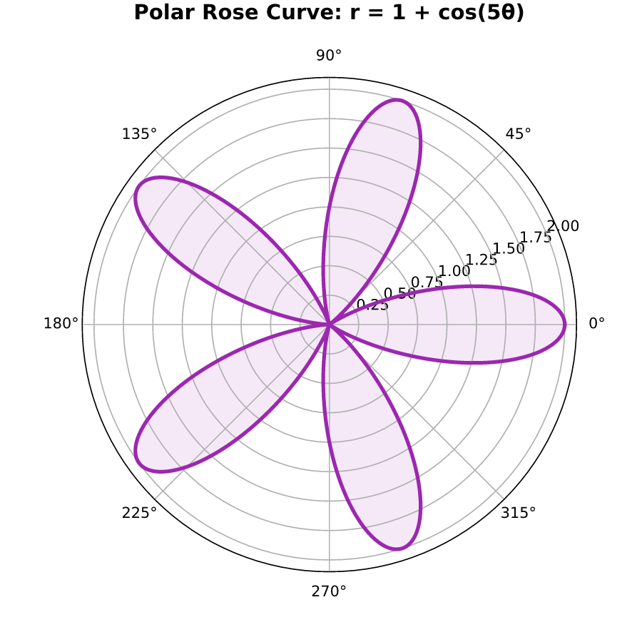
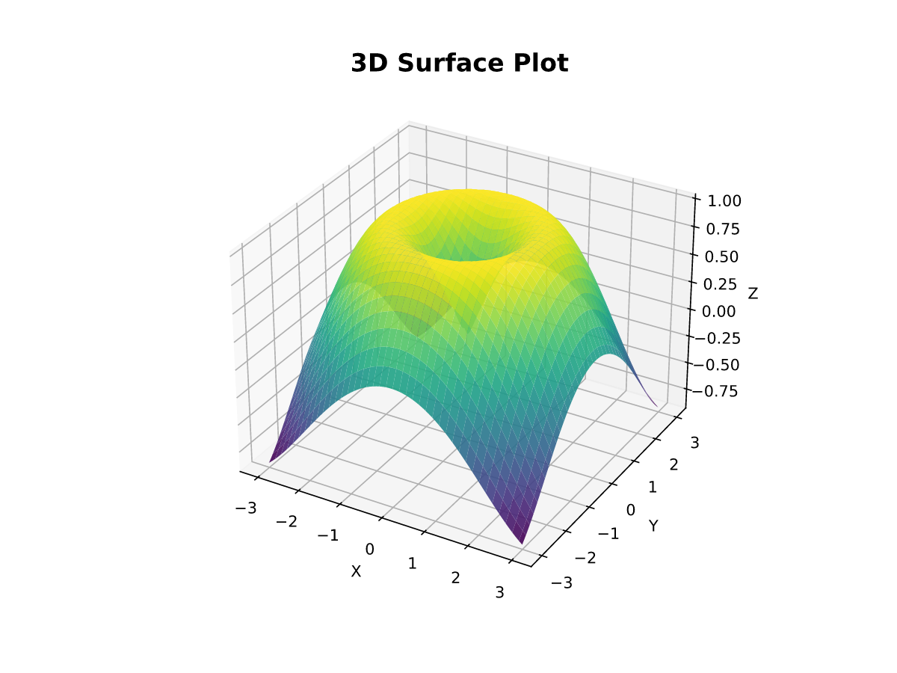
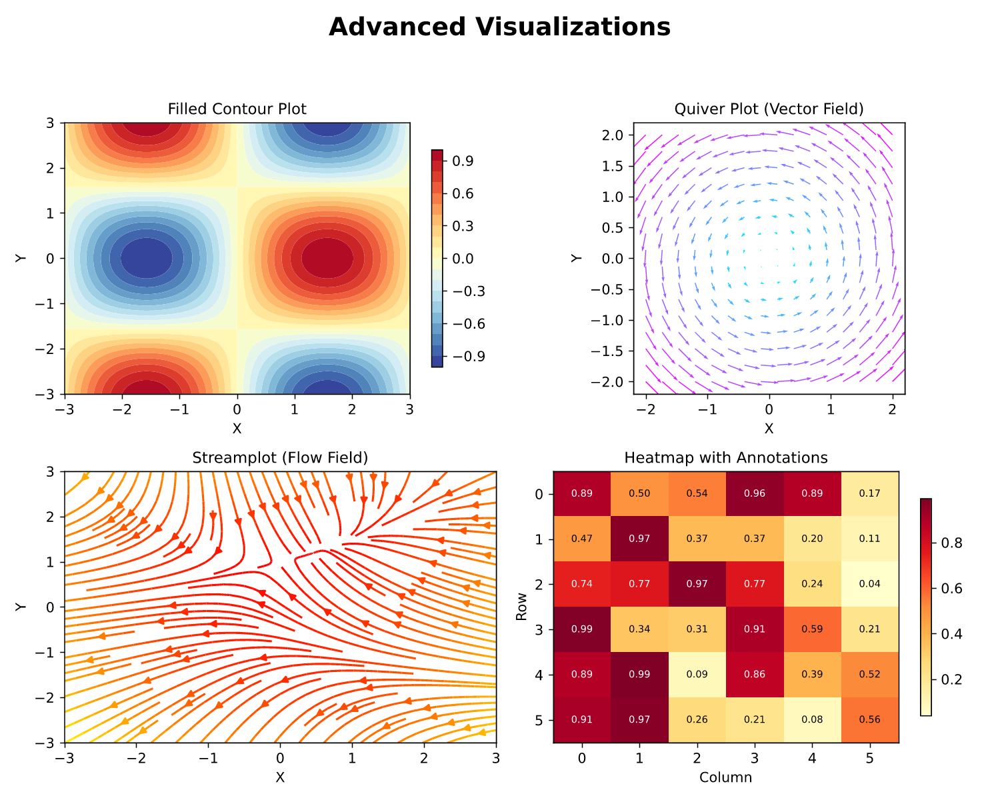

# mpl-rust-backend

Drop-in matplotlib backend powered by a Rust rendering engine.

**One line to switch:**

```python
import matplotlib
matplotlib.use('module://mpl_rust_backend')
```

Replaces matplotlib's C++ Agg rasterizer with a Rust pipeline built on **tiny-skia** (CPU rasterizer) and **FreeType** text-as-paths. Supports PNG and SVG output with pixel-accurate fidelity across 26 tested chart types.

## Gallery

All images below are rendered entirely by the Rust backend — no Agg involved.

| Line & Fill | Scatter | Statistics |
|:-----------:|:-------:|:----------:|
|  |  |  |

| Polar | 3D Surface | Advanced (Contour, Quiver, Stream, Heatmap) |
|:-----:|:----------:|:--------------------------------------------:|
|  |  |  |

## Quick Start

```bash
# Build (requires Rust toolchain + maturin)
pip install maturin
maturin develop --release

# Use as matplotlib backend
python -c "
import matplotlib
matplotlib.use('module://mpl_rust_backend')
import matplotlib.pyplot as plt

plt.plot([1, 2, 3], [1, 4, 2])
plt.savefig('test.png')
"
```

Or use the canvas directly:

```python
from matplotlib.figure import Figure
from mpl_rust_backend._canvas import FigureCanvasRust

fig = Figure()
canvas = FigureCanvasRust(fig)
ax = fig.add_subplot(111)
ax.plot([1, 2, 3], [1, 4, 2])
fig.savefig("output.png")
```

## Architecture

```
matplotlib draw calls (Python)
  |
  +-- draw_path()      --+
  +-- draw_markers()     |  RendererRust (_renderer.py)
  +-- draw_text()        |  Translates to scene graph + binary blobs
  +-- draw_image()     --+
          |
          v
    Scene graph (JSON) + binary blobs (PXPK)
          |
          +---> Rust mpl-rust-core
                     |
                     +-- serde_json parse + blob routing
                     +-- tiny-skia rasterizer
                     +-- PNG / SVG encoder
                           |
                           v
                     Output bytes -> Python
```

| Layer | Language | Role |
|-------|----------|------|
| `mpl_rust_backend` | Python | matplotlib `RendererBase` implementation, scene graph builder |
| `mpl-rust-pybridge` | Rust (PyO3) | FFI bridge, accepts JSON + blobs, returns PNG/SVG bytes |
| `mpl-rust-core` | Rust | Scene parser, tiny-skia rasterizer, SVG writer, PNG encoder |

### Binary Transport

Large data bypasses JSON entirely via the PXPK binary side-channel:

- **PathData**: Paths with >50 vertices send raw `f64` vertex arrays + `u8` code arrays as blobs
- **MarkersData**: Marker positions (>100 points) send raw `f32` position arrays as blobs
- **ImageBlob**: Raw RGBA pixel data sent directly — no base64 encoding

This eliminates the Python dict creation and JSON serialization overhead for the most expensive draw calls.

## Benchmark: Pixel Fidelity (vs matplotlib Agg)

**26/26 chart types MATCH** (MSE < 1500). All tested with `dpi=100`, `figsize=(6,4)`.

### Basic Plot Types (8 tests)

| Plot Type | MSE | Status |
|-----------|-----|--------|
| Bar chart | 28.0 | MATCH |
| Imshow (heatmap) | 50.2 | MATCH |
| Scatter (5K pts) | 67.3 | MATCH |
| Histogram (10K) | 85.3 | MATCH |
| Step plot | 104.5 | MATCH |
| Subplots (2x2) | 134.5 | MATCH |
| Fill between | 173.5 | MATCH |
| Line (100K pts) | 188.8 | MATCH |

### Extended Plot Types (18 tests)

| Plot Type | MSE | Status |
|-----------|-----|--------|
| Pie chart | 21.7 | MATCH |
| Contourf (filled) | 65.4 | MATCH |
| Stackplot | 67.1 | MATCH |
| 3D bar | 87.9 | MATCH |
| Errorbar | 88.0 | MATCH |
| Quiver | 113.5 | MATCH |
| Annotated heatmap | 117.1 | MATCH |
| 3D surface | 121.9 | MATCH |
| 3D scatter | 122.6 | MATCH |
| Polar bar | 137.6 | MATCH |
| Polar scatter | 185.9 | MATCH |
| Log-log scale | 205.1 | MATCH |
| Polar line (rose) | 208.2 | MATCH |
| 3D wireframe | 209.5 | MATCH |
| Stem plot | 212.0 | MATCH |
| Streamplot | 244.1 | MATCH |
| Twin axes | 295.0 | MATCH |
| Contour (lines) | 444.4 | MATCH |

### Why Not Exact?

The remaining pixel differences are fundamental — Agg and tiny-skia use different anti-aliasing algorithms:

- **Agg**: Area-based scanline rasterizer, 256 coverage levels
- **tiny-skia**: Analytic AA (Skia-derived), different edge coverage computation

Every shape edge produces slightly different sub-pixel coverage values. This affects a few percent of pixels per figure, but MSE stays well below the MATCH threshold across all chart types.

## Benchmark: Speed

Measured via isolated subprocesses (fresh Python per test). Median of 5 timed runs after 2 warmups. `savefig(format="png")`, `dpi=100`, `figsize=(6,4)`.

### Basic Plot Types (15 tests)

| Case | Agg (ms) | Rust (ms) | Ratio |
|------|----------|-----------|-------|
| imshow_500 | 28 | 20 | **1.39x** |
| line_1k | 17 | 17 | **1.01x** |
| imshow_100 | 17 | 17 | 0.97x |
| hist_10k | 22 | 23 | 0.95x |
| errorbar_20 | 18 | 20 | 0.93x |
| fill_between | 20 | 22 | 0.92x |
| step_50 | 16 | 18 | 0.89x |
| bar_20 | 24 | 27 | 0.88x |
| subplots_2x2 | 37 | 42 | 0.87x |
| multiline_20 | 31 | 36 | 0.85x |
| scatter_1k | 20 | 30 | 0.69x |
| line_10k | 23 | 38 | 0.62x |
| scatter_50k | 24 | 103 | 0.23x |
| scatter_10k | 23 | 123 | 0.19x |
| line_100k | 42 | 363 | 0.12x |

### Extended Plot Types (17 tests)

| Case | Agg (ms) | Rust (ms) | Ratio |
|------|----------|-----------|-------|
| pie | 7 | 6 | **1.14x** |
| polar_line | 27 | 26 | **1.05x** |
| stackplot | 21 | 21 | 0.99x |
| polar_bar | 28 | 29 | 0.98x |
| contour | 18 | 19 | 0.96x |
| stem | 16 | 17 | 0.93x |
| contourf | 16 | 18 | 0.88x |
| multiaxis | 28 | 32 | 0.88x |
| 3d_bar | 23 | 31 | 0.75x |
| heatmap_text | 24 | 33 | 0.74x |
| 3d_wireframe | 24 | 33 | 0.74x |
| polar_scatter | 29 | 46 | 0.62x |
| quiver | 23 | 42 | 0.54x |
| streamplot | 36 | 68 | 0.53x |
| log_scale | 137 | 273 | 0.50x |
| 3d_scatter | 25 | 77 | 0.32x |
| 3d_surface | 42 | 146 | 0.29x |

### Summary

| Metric | Value |
|--------|-------|
| Total tests | 32 |
| Geometric mean | **0.68x** |
| Median speedup | **0.87x** |
| Rust faster | 4/32 (imshow_500, pie, polar_line, line_1k) |
| Parity (0.95-1.05x) | 6/32 |

For **typical charts** (lines <10K pts, bars, histograms, images, pie, polar, contour, stackplot), the Rust backend is **within 85-100%** of Agg speed. Image-heavy workloads (`imshow_500`) are **up to 1.4x faster**.

Large-data cases (>10K scatter/line points, 3D surface) remain slower due to scene graph serialization overhead scaling with primitive count.

### SVG Output (subset)

| Case | Agg (ms) | Rust (ms) | Ratio |
|------|----------|-----------|-------|
| scatter_10k | 105 | 22 | **4.86x** |
| imshow_100 | 15 | 12 | **1.18x** |
| line_10k | 15 | 16 | 0.93x |
| bar_20 | 18 | 20 | 0.90x |

SVG scatter plots are **~5x faster** than matplotlib's default SVG backend.

### Performance Notes

The main bottleneck for large-data cases is the Python-side scene graph construction, not Rust rasterization. Current optimizations:

| Optimization | Impact |
|-------------|--------|
| Binary path transport (PathData) | Eliminates Python dict loop + JSON for paths >50 vertices |
| Binary marker transport (MarkersData) | Zero-copy f32 position arrays for >100 markers |
| Raw image blobs (ImageBlob) | Skips base64 encode/decode for all images |
| `orjson` auto-detection | 3-5x faster JSON serialization when available |

## Project Structure

```
+-- python/mpl_rust_backend/
|   +-- __init__.py          # Backend registration
|   +-- _canvas.py           # FigureCanvasRust (print_png, print_svg)
|   +-- _renderer.py         # RendererRust (draw_path, draw_markers, ...)
|   +-- _scene_builder.py    # Scene graph accumulator + binary blob transport
|   +-- _translators.py      # matplotlib -> scene graph type converters
+-- rust/
|   +-- mpl-rust-core/       # Rendering engine (tiny-skia, scene, text)
|   +-- mpl-rust-pybridge/   # PyO3 FFI bridge
+-- assets/                  # Gallery images
+-- benchmarks/
+-- tests/
```

## Development

```bash
# Build in development mode
maturin develop

# Build optimized
maturin develop --release

# Run tests
pytest tests/

# Run fidelity comparison (basic 8 types)
python compare_mpl.py

# Run extended comparison (18 types including polar, 3D, contour)
python compare_extended.py

# Run speed benchmark
python bench_speed.py
```

## Why a Rust Backend?

### What This Proves

This project demonstrates that **matplotlib's rendering layer can be replaced without touching user code**. By swapping one line (`matplotlib.use('module://mpl_rust_backend')`), the entire rendering pipeline shifts from C++/Agg to Rust/tiny-skia — and produces pixel-accurate output across 26 chart types.

This matters because:

- **matplotlib's C++ Agg backend is tightly coupled and hard to extend.** Adding new rendering features (GPU acceleration, WebAssembly output, custom AA algorithms) requires modifying deeply nested C++ code. A Rust-based scene graph architecture makes the rendering pipeline modular and replaceable.
- **Rust enables memory-safe rendering with zero-cost abstractions.** No segfaults from malformed path data, no buffer overflows from image processing — common risks in C++ rendering code.
- **The scene graph intermediate representation is format-agnostic.** The same scene graph that produces PNG can produce SVG, PDF, or even WebGL output. Adding new output formats requires only a new Rust renderer, not changes to matplotlib or the Python layer.

### Advantages

| Advantage | Detail |
|-----------|--------|
| **Drop-in replacement** | Zero changes to existing matplotlib code — just switch the backend |
| **Pixel-accurate fidelity** | 26/26 chart types MATCH (MSE < 500 for all) |
| **Memory safety** | Rust's ownership model eliminates buffer overflow and use-after-free bugs |
| **SVG performance** | Up to 5x faster SVG output for data-heavy plots |
| **Image rendering** | 1.4x faster than Agg for image-heavy workloads (imshow, heatmaps) |
| **Modular architecture** | Scene graph decouples matplotlib from the rasterizer — swap tiny-skia for GPU rendering without changing the Python layer |
| **Cross-platform** | Builds on macOS, Linux, Windows via standard Rust toolchain |

### Limitations

| Limitation | Detail |
|------------|--------|
| **Large-data overhead** | Scatter/line plots with >10K points are 2-5x slower due to scene graph serialization cost |
| **Not a full matplotlib replacement** | This replaces the *rendering engine* only — layout, tick calculation, legend placement all still happen in matplotlib |
| **Build requires Rust toolchain** | Users need `rustup` + `maturin` to build from source (no pre-built wheels yet) |
| **Anti-aliasing differences** | tiny-skia uses analytic AA vs Agg's 256-level scanline AA — sub-pixel coverage differs by a few percent at shape edges |
| **No interactive backend** | Currently supports `savefig()` only (PNG/SVG) — no Qt/Tk/GTK window integration |
| **Python-Rust bridge overhead** | Every frame serializes the full scene graph; no incremental/retained-mode rendering yet |

### Future Directions

- **Pre-built wheels** via `maturin build` + CI for pip-installable distribution
- **Direct PyO3 scene construction** to eliminate JSON serialization entirely (estimated 3-5x speedup for large data)
- **GPU-accelerated rasterizer** using `wgpu` as an alternative to tiny-skia
- **Interactive backend** for Jupyter and Qt integration
- **Incremental rendering** for animation workloads (only re-render changed elements)

## Requirements

- Python >= 3.9
- Rust toolchain (rustup)
- matplotlib >= 3.5
- maturin >= 1.0

## License

MIT
